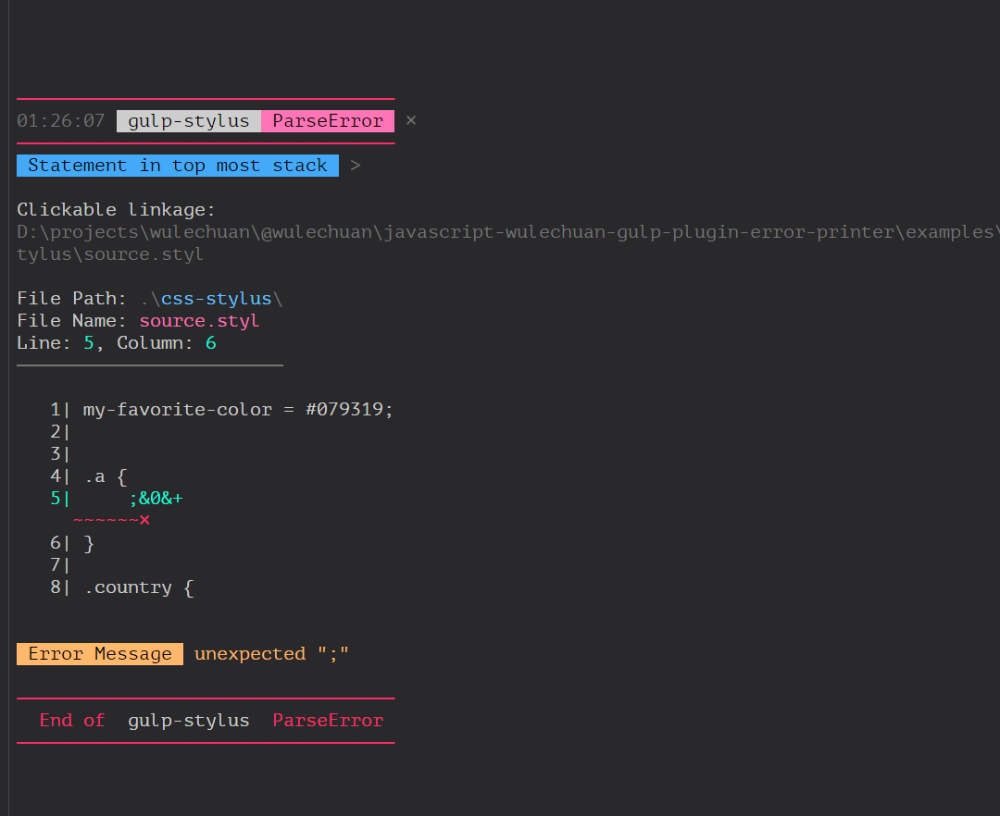
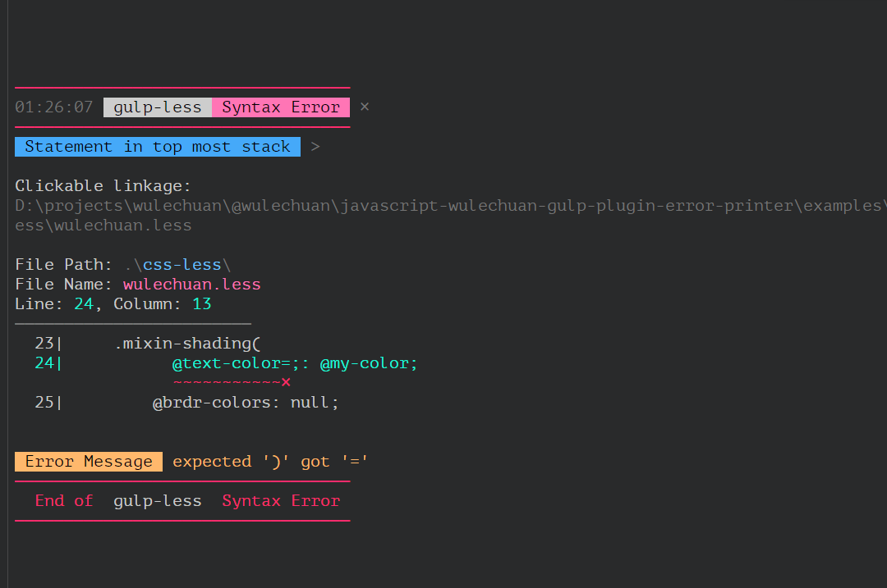
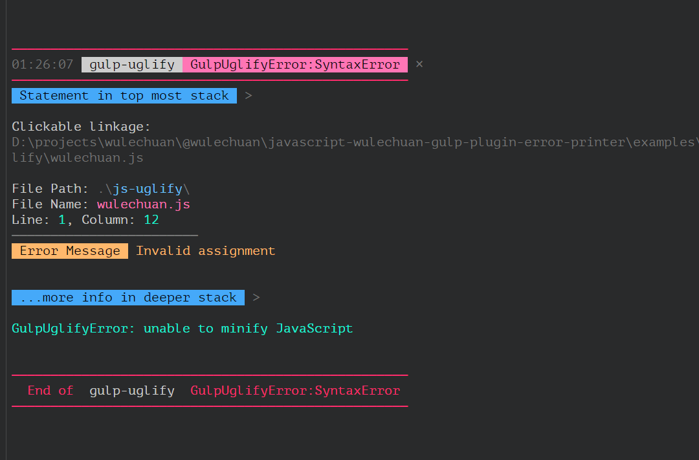

# NPM Page

[@wulechuan/javascript-gulp-plugin-error-printer](https://www.npmjs.com/package/@wulechuan/javascript-gulp-plugin-error-printer)

<br/>
<br/>
<br/>
<br/>

# Introduction

This is a message logging plugin for [gulp](https://gulpjs.com/).
It parses gulp's [PluginError](https://github.com/gulpjs/plugin-error) instance,
and is expected to print a more beautiful log for the error instance,
as long as a parser is provided for that specific type of PluginError.

<br/>
<br/>

## Supported Plugins So Far

* [gulp-uglify](https://www.npmjs.com/package/gulp-uglify)
* [gulp-stylus](https://www.npmjs.com/package/gulp-stylus)
* [gulp-less](https://www.npmjs.com/package/gulp-less)

For those not supported errors,
the error log from this logging plugin will naturally fallback to original formation.

<br/>
<br/>
<br/>
<br/>

# Usage

## Example Codes

See the `gulpfile.js` included by this repository as an example.

Below are the key snippet from the said `gulpfile.js`.

```javascript
const printGulpPluginErrorBeautifully = require('.');

const exampleSourceFileBasePath = './examples';


// This simply helps the logger print shorter paths
// so that file paths looks better in narrow console windows.
const basePathToShortenPrintedFilePaths = exampleSourceFileBasePath;


gulp.task('build: css: stylus (2)', (thisTaskIsDone) => {
	const taskSteps = [];

	taskSteps.push(gulp.src(joinPath(exampleSourceFileBasePath, 'css-stylus/source.styl')));
	taskSteps.push(compileStylus());

	pump(taskSteps, (theError) => {
		if (theError) {
			printGulpPluginErrorBeautifully(theError, basePathToShortenPrintedFilePaths);
		}

		thisTaskIsDone();
	});
});

```
<br/>
<br/>

## Try It Out, See It in Action

There is a dummy project included within this repository,
so that people can try this logger without difficulty.

The said dummy project locates here:
```sh
<this repository root folder>/examples
```


#### Before You Try

Before you can start trying,
you first need to install all dependencies for this npm project.

> This is a one time action, you don't need to do it
> every time before you run the tryout script.

Open a console/terminal and run:
```sh
npm install
```
or even simpler:
```sh
npm i
```

#### Run the Tryout Script

Open a console/terminal and run:

```sh
npm start
```

or even simpler:

```sh
gulp
```

That's it.

<br/>

### Some Snapshots of Mine

Below are some snapshots of my console,
hosted within Microsoft [Visual Studio Code](https://code.visualstudio.com/).

> By the way, the used color theme of my Visual Studio Code,
> shown in the illustrates below,
> is the "[Panda Theme]()".

A Stylus compilation error.


A LESSCSS compilation error.


A UglifyJs parsing error.


<br/>
<br/>

## Configurations

Currently only colors are configurable.
So you may call if "color theme configurations" if you prefer.

See [configurations.md](./docs/configurations.md).

<br/>
<br/>
<br/>
<br/>

# Known Issues

When utilizing the `on('error')` method of a gulp's pipeline,
the error will propagate outside the event handler,
and will finally get printed the traditional way.
Since this logger also prints the error, the error is printed **twice**.

I'll learn how to *swallow* the error inside this logger in the future.

<br/>
<br/>
<br/>
<br/>

# API

Sorry. I don't have too much spare time at present.
I have my boy to take care of.

Consult my *ugly* source codes if you'd like to. :p
